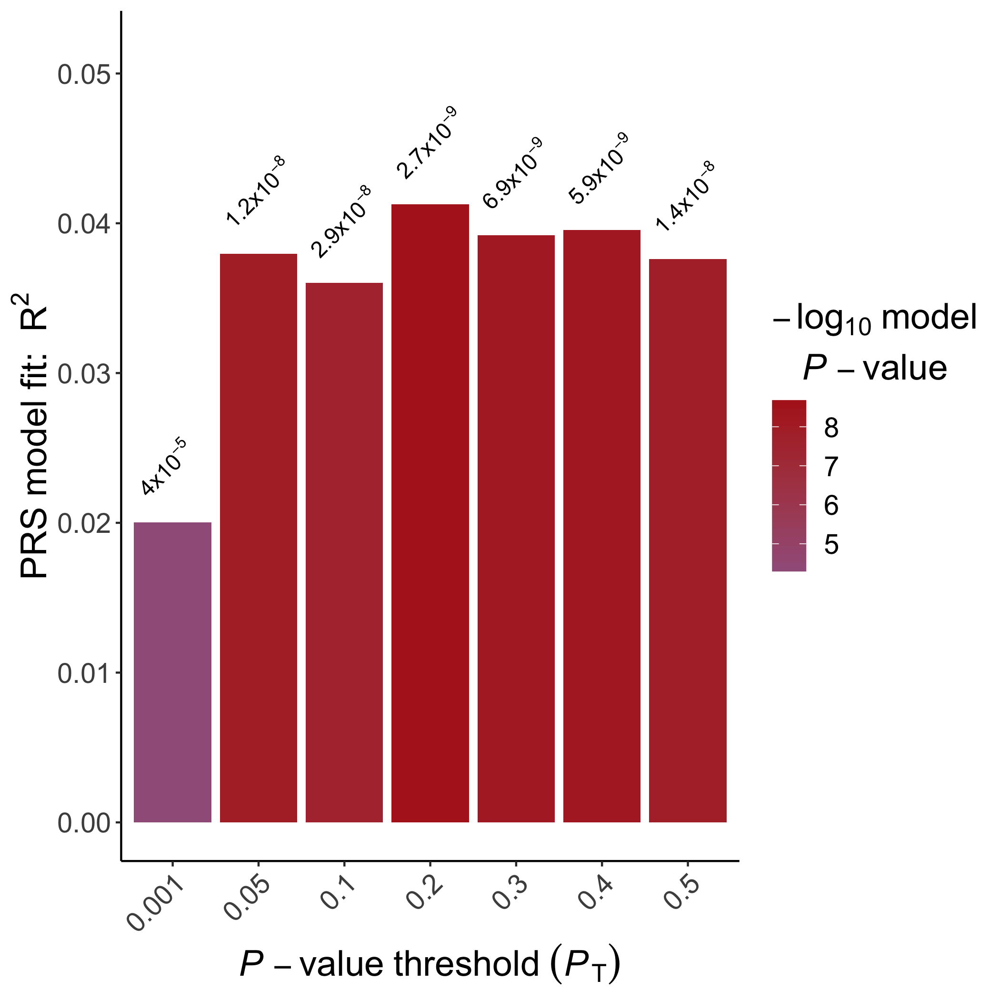
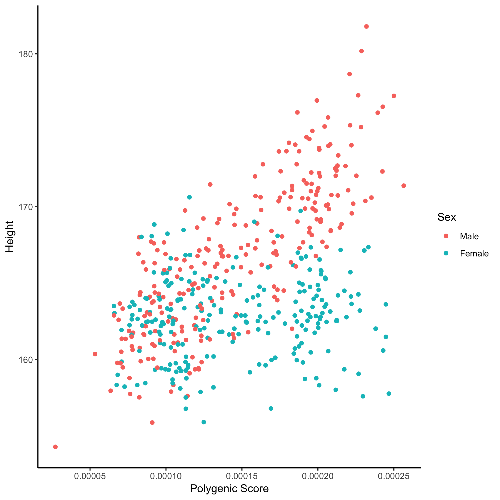

# Plotting the Results
The PRS results corresponding to a range of P-value thresholds obtained by application of the C+T PRS method (eg. using PLINK or PRSice-2) can be visualised using `R` as follows:

!!! note
    We will be using `prs.result`, which was generated in the [previous section](#finding-the-best-p-value-threshold)

```R tab="Without ggplot2"
# We strongly recommend the use of ggplot2. Only follow this code if you
# are desperate.
# Specify that we want to generate plot in EUR.height.bar.png
png("EUR.height.bar.png",
      height=10, width=10, res=300, unit="in")
# First, obtain the colorings based on the p-value
col <- suppressWarnings(colorRampPalette(c("dodgerblue", "firebrick")))
# We want the color gradient to match the ranking of p-values
prs.result <- prs.result[order(-log10(prs.result$P)),]
prs.result$color <-  col(nrow(prs.result))
prs.result <- prs.result[order(prs.result$Threshold),]
# generate a pretty format for p-value output
prs.result$print.p <- round(prs.result$P, digits = 3)
prs.result$print.p[!is.na(prs.result$print.p) & prs.result$print.p == 0 ] <-
    format(prs.result$P[!is.na(prs.result$print.p) & prs.result$print.p == 0 ], digits = 2)
prs.result$print.p <- sub("e", "*x*10^", prs.result$print.p)
# Generate the axis labels
xlab <- expression(italic(P) - value ~ threshold ~ (italic(P)[T]))
ylab <- expression(paste("PRS model fit:  ", R ^ 2))
# Setup the drawing area
layout(t(1:2), widths=c(8.8,1.2))
par( cex.lab=1.5, cex.axis=1.25, font.lab=2, 
    oma=c(0,0.5,0,0),
    mar=c(4,6,0.5,0.5))
# Plotting the bars
b<- barplot(height=prs.result$R2, 
            col=prs.result$color, 
            border=NA, 
            ylim=c(0, max(prs.result$R2)*1.25), 
            axes = F, ann=F)
# Plot the axis labels and axis ticks
odd <- seq(0,nrow(prs.result)+1,2)
even <- seq(1,nrow(prs.result),2)
axis(side=1, at=b[odd], labels=prs.result$Threshold[odd], lwd=2)
axis(side=1, at=b[even], labels=prs.result$Threshold[even],lwd=2)
axis(side=1, at=c(0,b[1],2*b[length(b)]-b[length(b)-1]), labels=c("","",""), lwd=2, lwd.tick=0)
# Write the p-value on top of each bar
text( parse(text=paste(
    prs.result$print.p)), 
    x = b+0.1, 
    y =  prs.result$R2+ (max(prs.result$R2)*1.05-max(prs.result$R2)), 
    srt = 45)
# Now plot the axis lines
box(bty='L', lwd=2)
axis(2,las=2, lwd=2)
# Plot the axis titles
title(ylab=ylab, line=4, cex.lab=1.5, font=2 )
title(xlab=xlab, line=2.5, cex.lab=1.5, font=2 )
# Generate plot area for the legend
par(cex.lab=1.5, cex.axis=1.25, font.lab=2, 
      mar=c(20,0,20,4))
prs.result <- prs.result[order(-log10(prs.result$P)),]
image(1, -log10(prs.result$P), t(seq_along(-log10(prs.result$P))), col=prs.result$color, axes=F,ann=F)
axis(4,las=2,xaxs='r',yaxs='r', tck=0.2, col="white")
# plot legend title
title(bquote(atop(-log[10] ~ model, italic(P) - value), ), 
          line=2, cex=1.5, font=2, adj=0)
# write the plot to file
dev.off()
q() # exit R
```

```R tab="ggplot2"
# ggplot2 is a handy package for plotting
library(ggplot2)
# generate a pretty format for p-value output
prs.result$print.p <- round(prs.result$P, digits = 3)
prs.result$print.p[!is.na(prs.result$print.p) &
                       prs.result$print.p == 0] <-
    format(prs.result$P[!is.na(prs.result$print.p) &
                            prs.result$print.p == 0], digits = 2)
prs.result$print.p <- sub("e", "*x*10^", prs.result$print.p)
# Initialize ggplot, requiring the threshold as the x-axis (use factor so that it is uniformly distributed)
ggplot(data = prs.result, aes(x = factor(Threshold), y = R2)) +
    # Specify that we want to print p-value on top of the bars
    geom_text(
        aes(label = paste(print.p)),
        vjust = -1.5,
        hjust = 0,
        angle = 45,
        cex = 4,
        parse = T
    )  +
    # Specify the range of the plot, *1.25 to provide enough space for the p-values
    scale_y_continuous(limits = c(0, max(prs.result$R2) * 1.25)) +
    # Specify the axis labels
    xlab(expression(italic(P) - value ~ threshold ~ (italic(P)[T]))) +
    ylab(expression(paste("PRS model fit:  ", R ^ 2))) +
    # Draw a bar plot
    geom_bar(aes(fill = -log10(P)), stat = "identity") +
    # Specify the colors
    scale_fill_gradient2(
        low = "dodgerblue",
        high = "firebrick",
        mid = "dodgerblue",
        midpoint = 1e-4,
        name = bquote(atop(-log[10] ~ model, italic(P) - value),)
    ) +
    # Some beautification of the plot
    theme_classic() + theme(
        axis.title = element_text(face = "bold", size = 18),
        axis.text = element_text(size = 14),
        legend.title = element_text(face = "bold", size =
                                        18),
        legend.text = element_text(size = 14),
        axis.text.x = element_text(angle = 45, hjust =
                                       1)
    )
# save the plot
ggsave("EUR.height.bar.png", height = 7, width = 7)
q() # exit R
```


> An example bar plot generated using `ggplot2`

In addition, we can visualise the relationship between the "best-fit" PRS (which may have been obtained from any of the PRS programs) and the phenotype of interest, coloured according to sex:

```R tab="Without ggplot2"
# Read in the files
prs <- read.table("EUR.0.2.profile", header=T)
height <- read.table("EUR.height", header=T)
sex <- read.table("EUR.covariate", header=T)
# Rename the sex
sex$Sex <- as.factor(sex$Sex)
levels(sex$Sex) <- c("Male", "Female")
# Merge the files
dat <- merge(merge(prs, height), sex)
# Start plotting
plot(x=dat$SCORE, y=dat$Height, col="white",
    xlab="Polygenic Score", ylab="Height")
with(subset(dat, Sex=="Male"), points(x=SCORE, y=Height, col="red"))
with(subset(dat, Sex=="Female"), points(x=SCORE, y=Height, col="blue"))
q() # exit R
```

```R tab="ggplot2"
library(ggplot2)
# Read in the files
prs <- read.table("EUR.0.2.profile", header=T)
height <- read.table("EUR.height", header=T)
sex <- read.table("EUR.covariate", header=T)
# Rename the sex
sex$Sex <- as.factor(sex$Sex)
levels(sex$Sex) <- c("Male", "Female")
# Merge the files
dat <- merge(merge(prs, height), sex)
# Start plotting
ggplot(dat, aes(x=SCORE, y=Height, color=Sex))+
    geom_point()+
    theme_classic()+
    labs(x="Polygenic Score", y="Height")
q() # exit R
```


> An example scatter plot generated using `ggplot2`


Programs such as PRSice-2 and [bigsnpr](https://privefl.github.io/bigsnpr/) include numerous options for plotting PRS results.

